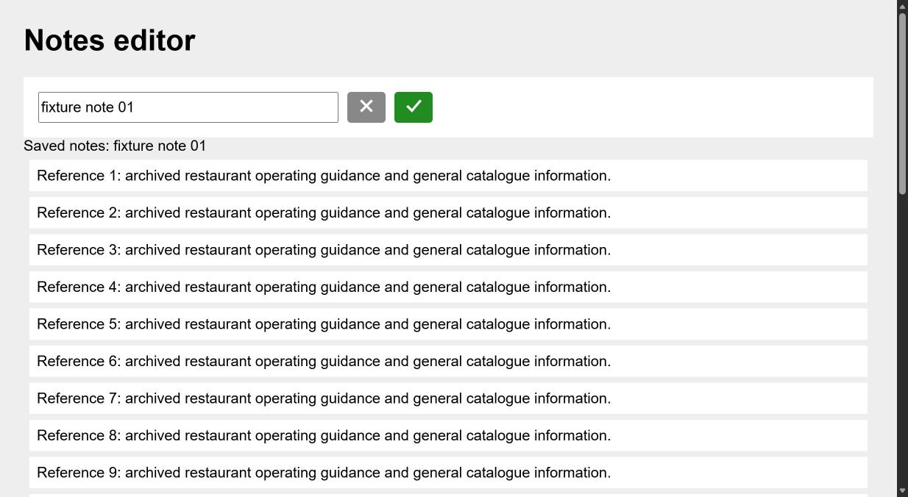
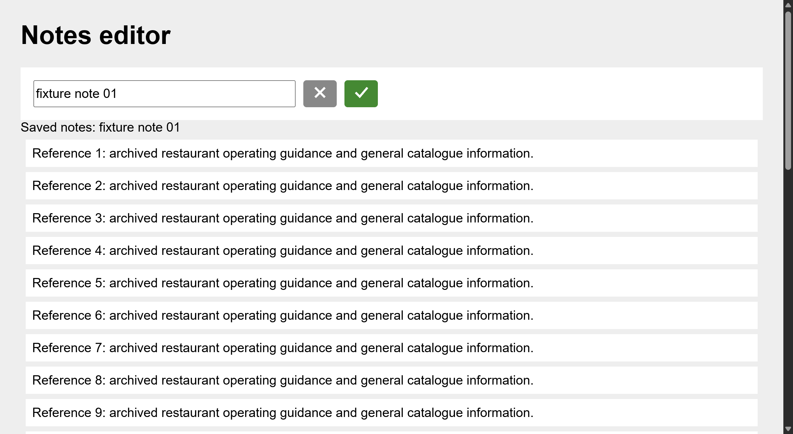

# Simplified workflow versus native Notes check — 2026-10-08

Henry requested dropping query filtering and workflow reranking, reaching native token parity and stopping further tuning. The workflow now rejects retired query arguments before dispatch, omits query from MCP schemas, and never loads or invokes its reranker provider. The office service and experimental non-workflow consumers are separate. Deterministic protected state, bounded output, source-bound action guards and canonical recovery remain. Unnamed visible top-document controls get finite captured CSS viewport boxes, with explicit coordinate-space guidance; iframe-local boxes are withheld rather than guessed into screenshot space. Removed query-only DOM grouping and query helper/tests. Installed Claude/Codex workflow and browser-QA skills were updated to omit query and use captured geometry.

| Recorded whole attempt | Native extension | Simplified CDP |
| --- | ---: | ---: |
| Independently verified exact save once / final pixels | pass | pass |
| Processed assistant tokens | 262,101 | 122,845 |
| Estimated assistant API USD | 0.01024671 | 0.00775458 |
| Browser calls | 11 | 3 |
| Historical expansions | 0 | 0 |
| Model requests | 14 | 7 |
| Peak input tokens | 24,712 | 27,854 |
| Context compactions | 0 | 0 |

CDP used 53.1% fewer processed tokens and 24.3% less estimated cost for this small whole attempt. Captured geometry allowed direct source-key fill/click, avoiding the previous icon-discovery expansion. The controller checked accepted server requests (exact text, exactly once) and actual saved screenshot pixels for both arms. Agent self-reported call counts were inaccurate; raw transcript auditing supplies the table.

## Contract and qualifications

Byte-identical business prompts, frozen fixture, fresh Claude Code 2.1.295 contexts, Haiku5.5 medium, 250k compaction setting, same initial/final pixels and result obligations, 12-call/three-minute stated contract, no JS mutation/shell/subagents or Mako data changes. Both read two local files, load tools once and write one result. Native ran first; order was not balanced. CDP bridge enforces admitted acts/deadline; native's contract limit is prompt-based.

Native had no existing extension tab group: a tab-create failure was followed by tab-group recovery, navigation and resize. Four setup calls, one final tab close and all recovery tokens stay in the totals. CDP was controller-preallocated/activated/resized; controller setup cost is excluded. Native made six computer calls, including three screenshots. CDP made one initial screenshot and two acts, with final pixels included in the click result; two screenshots total. Native's extra pre-confirm screenshot was not a tool failure and stays in cost.

Images did not fully match: native retained JPEGs 1234x676; CDP retained PNGs 2468x1352 despite controller CSS viewport emulation 1234x676/DPR1. The model's CDP image blocks were resized by transport. CDP peak input was higher. Therefore this is an operational pilot, not a controlled isolation of browser implementation, image encoding or steady-state cost, and not proof of parity on the difficult WebSRM/iframe journeys. Previous failing hard-flow measurements remain valid. No compactions occurred; no compression win is claimed. Stop optimization runs at this checkpoint per Henry's direction.

Runtime build: 64d4a8b-dirty at 2026-10-08T23:57:49Z, frozen across workers. proof.json archives source-backed compiled hashes, prompt/fixture hashes and independent verification. Per-arm configs/launch scripts/usage audits retained; raw transcripts and parsed tool results remain under C:/Users/wingz/OneDrive/Documents/ChatGPT/Work/native-parity-notes-01. The estimates use gym.mjs pricing-as-of2026-10-07, include cache creation/read/output and failed calls, and exclude subscription billing/controller costs.

Validation: build/typecheck; 508 unit tests passed/9 skipped; five real-Chrome compact tests passed. An earlier live run passed assertions but failed Windows profile cleanup with EBUSY; a stable-build rerun passed the full suite. Whole-repository line coverage61.56% is below documented80%, tracked in cdp-cli-yr7. No image or source-key guessing is added to execution.

